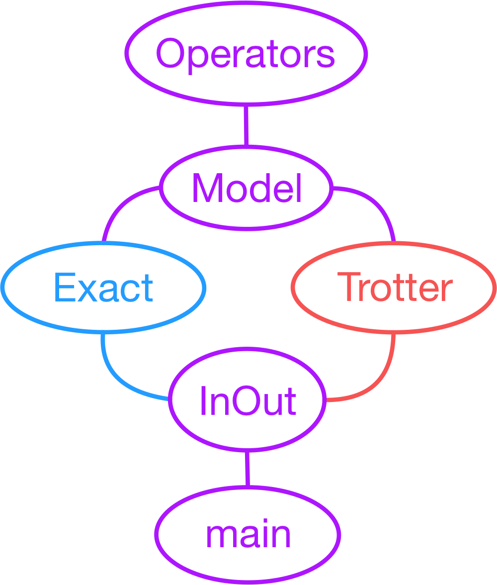

# Time evolution of the Heisenberg model

The source code for the dynamics of the Heisenberg model is found in [src](src) with the header files included in [include](include).
The program is written in C++ with a dependency on the linear algebra library called Eigen. It can be built by using CMake (follow the instructions inside `build-run_instructions.txt`).

The program includes the code for constructing the desired Heisenberg model, which can then be time evolved using exact diagonalization or Trotter-Suzuki schemes.
The program is run through an Input/Output layer, which requires an input file, and returns the data through an output file.
To run the program one also needs to specify the scalar type of the scheme parameters: `path_to_build/main input_file.in scalar_type`.

Examples for input files on time evolution can be found in [Evolution/Heisenberg](Input_files/Evolution/Heisenberg/), where this can be done with exact diagonalization or Trotterizations.
More examples for input files for computing the Trotter error can be found inside [Errors/Heisenberg](Input_files/Errors/Heisenberg/), where one can specify the computation through operators or states.
Simulations with operators are faster at small system size, but quickly grow beyond the resource capabilities, which is where simulations with states become important.

## Dependency graph

The diagram below provides an overview of the class structure.

